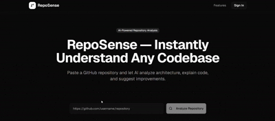
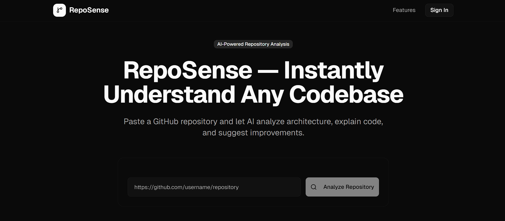
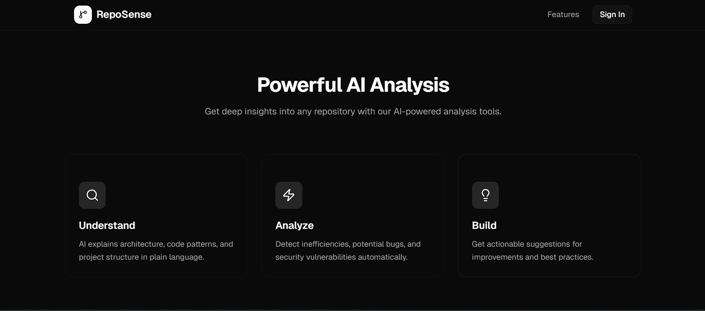
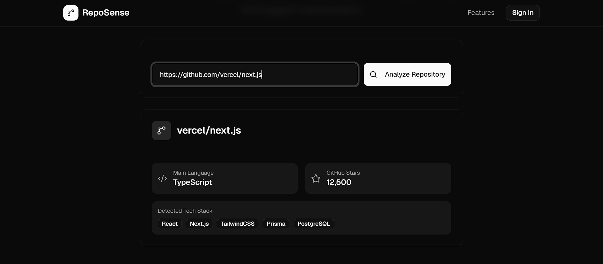

<h1 align="center">RepoSense</h1>

<p align="center">
AI-powered developer assistant that instantly analyzes any GitHub repository and explains the codebase.
</p>

<p align="center">
Paste a repository URL and RepoSense detects the tech stack, analyzes project structure, and provides architectural insights.
</p>

<p align="center">


</p>

<p align="center">

<a href="https://reposense.vercel.app"><b>Live Demo</b></a> •
<a href="#features"><b>Features</b></a> •
<a href="#installation"><b>Installation</b></a> •
<a href="#architecture"><b>Architecture</b></a>

</p>

---

## Why RepoSense

Developers often struggle to understand unfamiliar codebases quickly.

RepoSense helps developers:

- Understand project architecture faster
- Detect technologies used in a repository
- Analyze codebases without manually reading every file
- Accelerate onboarding for new developers

---

## Demo



---

## Screenshots

### Repository Analyzer


### AI Features Overview


### Repository Analysis


---

## Features

### Repository Analysis
Analyze any public GitHub repository instantly.

### Tech Stack Detection
Automatically detect frameworks and technologies used in the repository.

### Developer Insights
Understand unfamiliar codebases quickly.

### Architecture Understanding
Identify key layers in the project.

---

## How It Works

1. User submits a GitHub repository URL
2. RepoSense fetches repository metadata
3. Repository files are analyzed
4. Tech stack is detected
5. Results are presented to the user

---

## Architecture

RepoSense follows a simple client-server architecture.

```
User
↓
Frontend (Next.js)
↓
API Route (/api/analyze)
↓
GitHub API
↓
Repository Analysis Engine
```


---

## Tech Stack

Frontend
- Next.js
- React
- TailwindCSS

Backend
- Next.js API Routes
- GitHub REST API

Infrastructure
- Vercel

---

## Installation

Clone the repository:

```
git clone https://github.com/Aadya2901/RepoSense.git
cd RepoSense
```

Install dependencies:

```
npm install
```

Run development server:

```
npm run dev
```

---

## Deployment

RepoSense can be deployed easily using Vercel.

1. Push the repository to GitHub
2. Go to Vercel
3. Import the repository
4. Deploy

The application will be live in seconds.

---

## Project Structure

```
RepoSense
├── app
│ ├── api
│ │ └── analyze
│ └── page.tsx
├── src
│ └── lib
│ └── supabase.ts
├── public
├── README.md
```
---


---

## Roadmap

- AI architecture explanation  
- Repository health score  
- Dependency graph visualization  
- Codebase summarization  

---

## Author

**Aadya Patel**

---

## Contributing

Contributions are welcome.

1. Fork the repository
2. Create a feature branch
3. Commit your changes
4. Open a Pull Request

---

## License

This project is licensed under the **MIT License**.